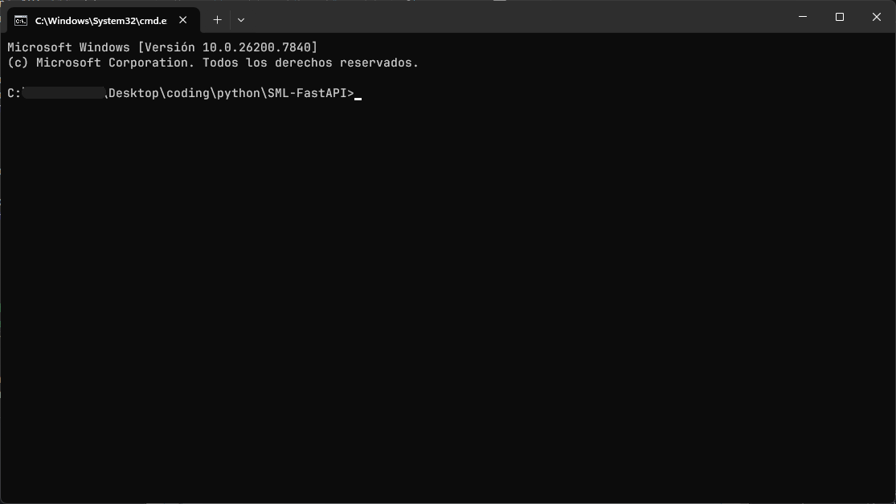

# Descripción 

Este es un ejemplo sencillo de una API creada en python con FastAPI para conectar un modelo de IA, en este caso especifico Llama3.2:1b de parametros, uno de los mas ligeros y potentes, para su uso debera tener instalado `python 3.12` como minimo y `pip` para la instalacion de librerias necesarias, recuerde que deben estar en su `$PATH` de su sistema operativo para reconocer la ubicacion del ejecutable.  
Existen diferentes programas de escritorio para ejecutar modelos de IA (LMStudio, Ollama, vLLM), debido a que interactuo más con la consola emplee Ollama para este ejemplo y en exigencia de recursos es poca al ejecutar modelos de pocos parametros a comparación de los gigantes que se encuentran en sitios webs funcionando.  

## Recursos de instalación  
 
Python: https://www.python.org/downloads/  
Ollama: https://ollama.com/download/windows  
pip: https://pip.pypa.io/en/stable/installation/  

## Instalación de recursos

Luego de descargar el zip del proyecto, deberá crear un entorno virtual, inicializarlo dentro de la carpeta que contiene todos los archivos descargados.  
Crear entorno virtual `python -m venv venv`, activar el entorno `source .\venv\Scripts\activate`. Para errores presentados visite [venv python](https://docs.python.org/3.14/library/venv.html), y pregunte a algún modelo de IA.
Para instalar los requirements.txt use `pip install -r requirements.txt`.  
Todo esto debera hacerlo en una terminal que contenga la ubicación del proyecto, puede usar cmd, powershell o bash, el que mejor domine, así debera ver su terminal.  

## Ejecución de proyecto

